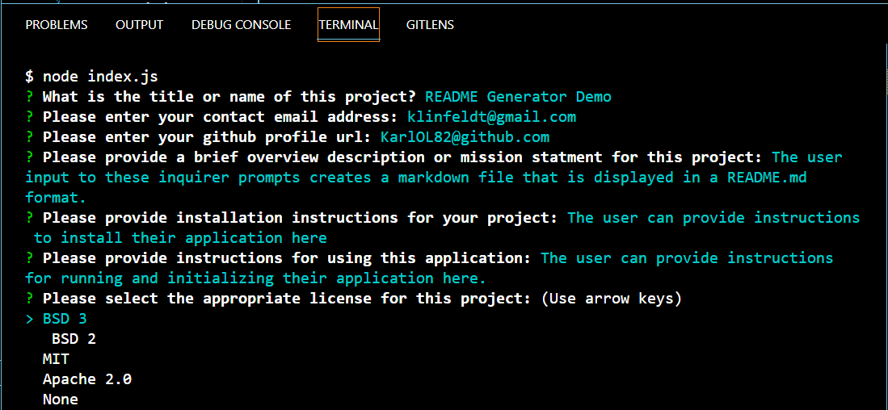
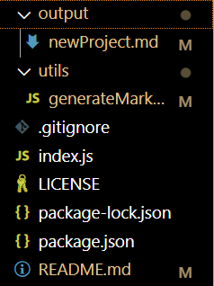
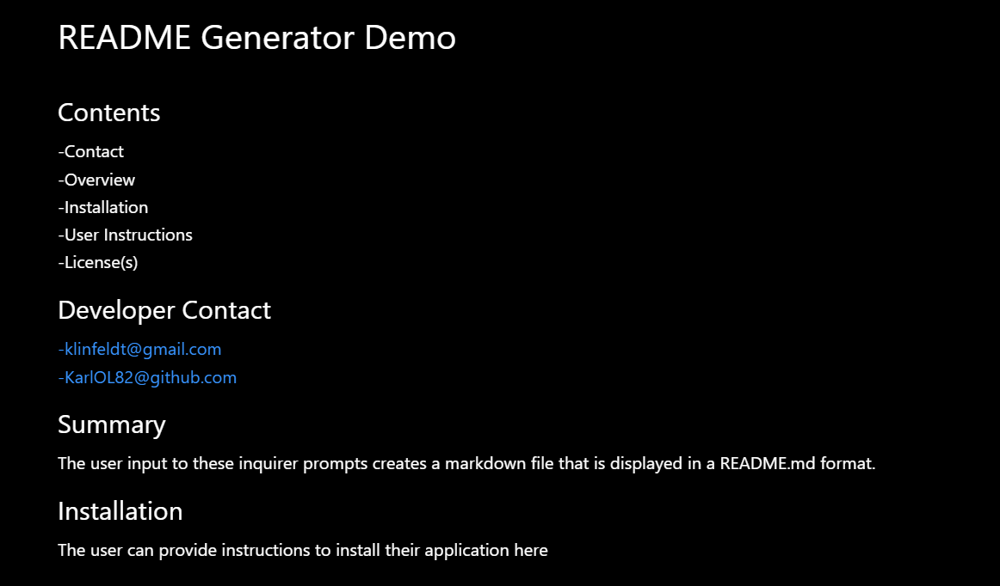

# README Generator
A Javascript app that generates a README.md file based on user input.

## Developed By
-Karl Linfeldt  
-[Github](https://github.com/KarlOL82/readMeGenerator)

## User Story
AS A Bootcamp student
I WANT to create an application that easily allows me to generate a README.md file for each project or assignment I create.
SO THAT I consistently have a professional README file to accompany my coursework.

## Overview 
This application was created with Javascript and runs in Node.JS with the Inquirer package. The user is prompted to provide input to specific questions and prompts which then gets printed as a generated Markdown file.

## Built With
-Javascript  
-Node.js  
-Inquirer  
-NPM

## Photos
  
  

